# E-Wallet

This is a simple Web Application that demonstrates the basic functionalities of a digital wallet.  
It provides a smooth and intuitive UI, manages data using a relational database, handles multiple users and transactions, lets you manage your profile, view transaction histoy, request payment from someone and even takes care of notifications.
All that using some basic _HTML_, _CSS_, _JS_ and _PHP_ with the support of _MySQL_.

## Features

- Signup and Login
- Add money to the wallet through credit card
- Make payments to other users
- Pay bills for mobile and DTH services
- Passbook to view transaction history
- Request Payment from another user
- Manage Profile, edit personal info, change password
- Notifications for payment requests

## Screenshots

<details>
  <summary>Click to expand</summary>

| 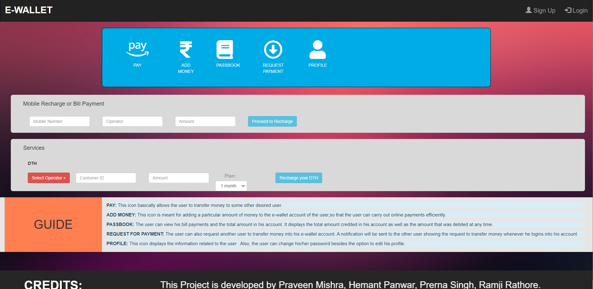 |
| :-----------------------------------------------------: |
|                      Landing page                       |

| 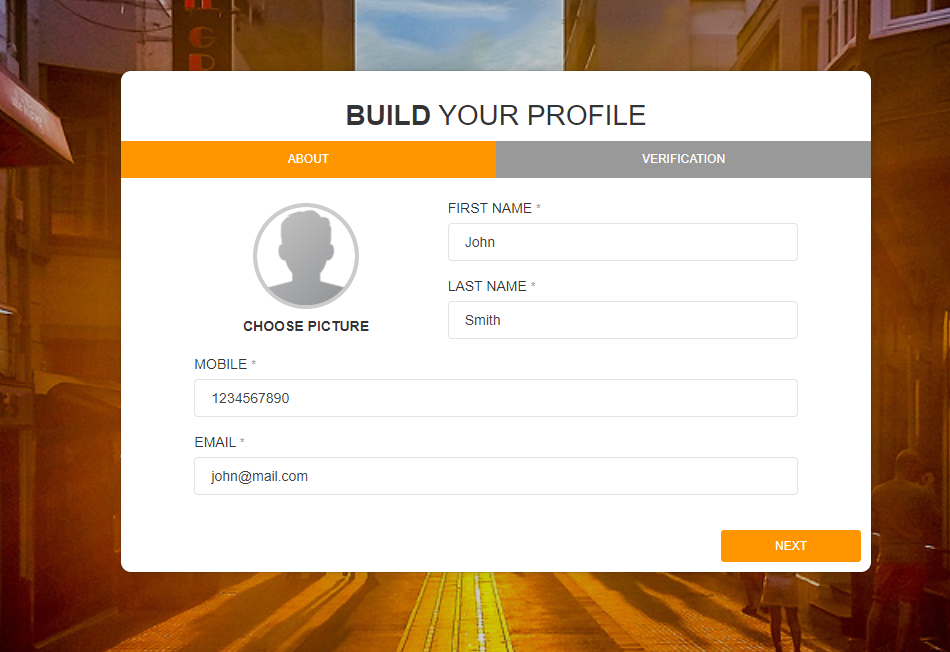 | 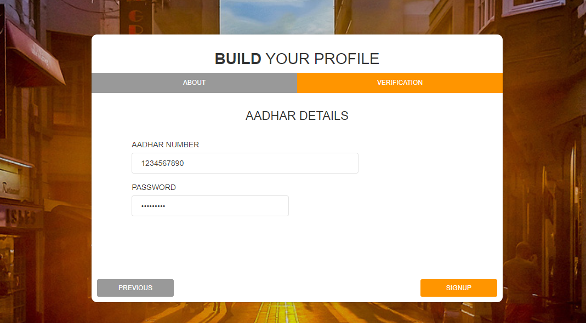 |
| :---------------------------------------------------------------------: | :----------------------------------------------------------------------------: |
|                             Signup - About                              |                             Signup - Verification                              |

<div>
  <div align="center">
    
  </div>

  <div align="center">
    Login
  </div>
</div>

<br />

| 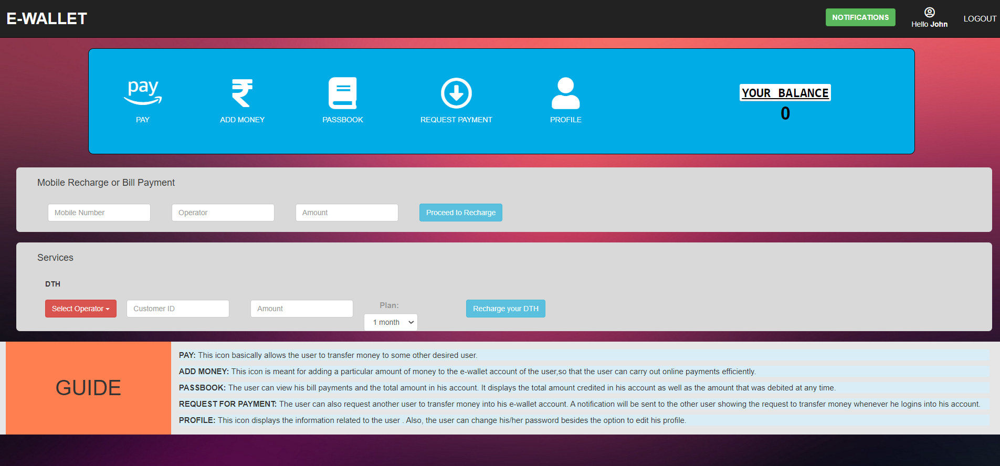 |
| :-------------------------------------------: |
|                   Homepage                    |

| 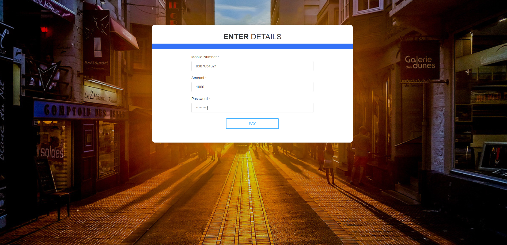 | 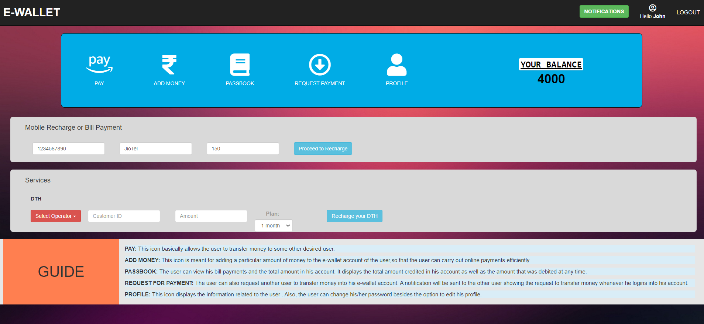 |
| :-----------------------------------------------------------------: | :------------------------------------------: |
|                             Pay - User                              |                Pay - Service                 |

<div>
  <div align="center">
    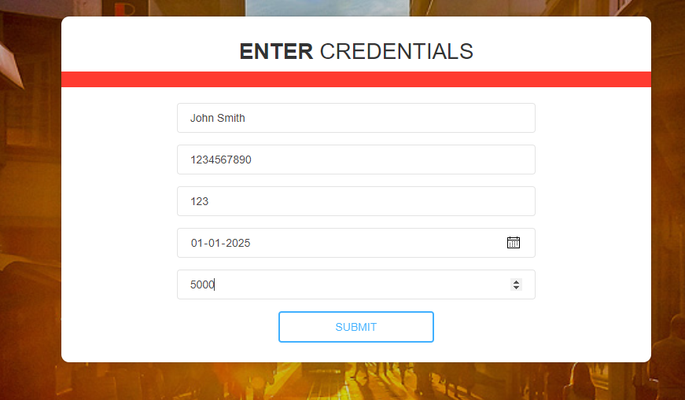
  </div>

  <div align="center">
    Add Money
  </div>
</div>

<br />

| 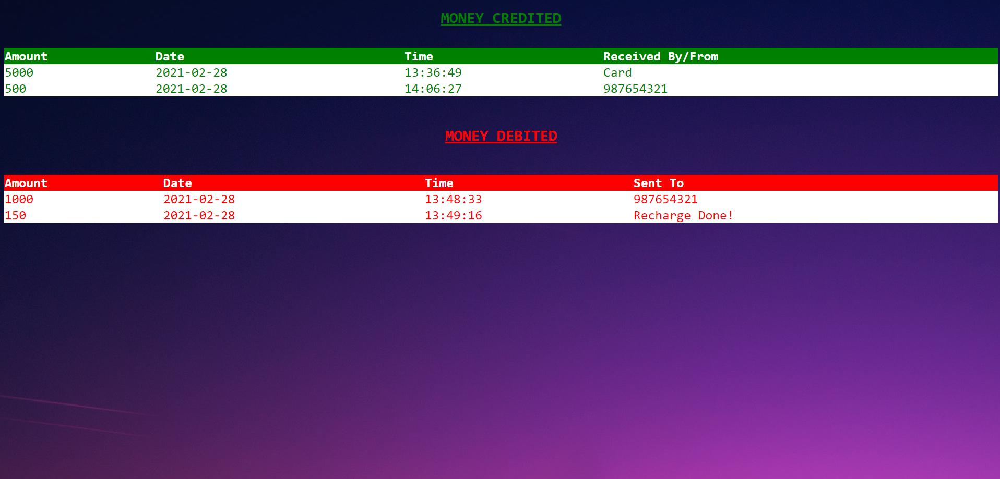 |
| :-------------------------------------------: |
|                   Passbook                    |

<div>
  <div align="center">
    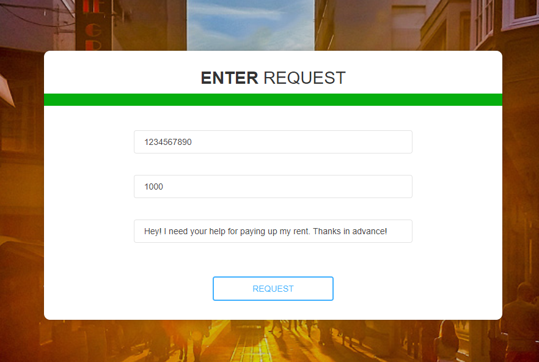
  </div>

  <div align="center">
    Request Payment
  </div>
</div>

<br />

| 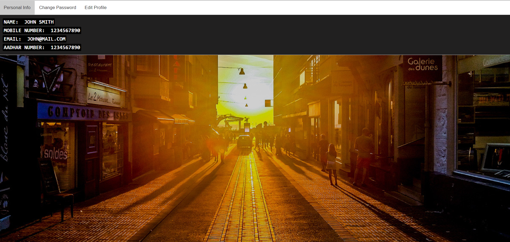 |
| :--------------------------------------------------------: |
|                          Profile                           |

| 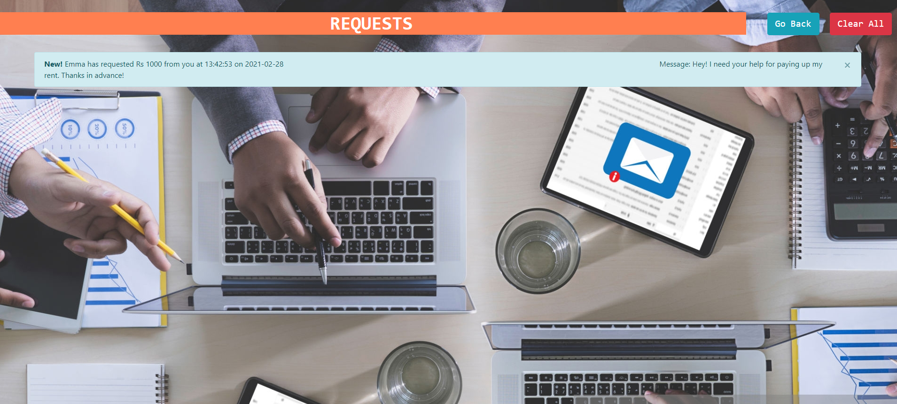 |
| :------------------------------------------------: |
|                   Notifications                    |

</details>

## Setup

### Fork and Clone this reposirory

- Fork this repository using the button in the top-right corner of the page. Refer https://docs.github.com/en/github/getting-started-with-github/fork-a-repo for more details.

- Having forked the repository, clone the repository to your local machine by using the below command in your terminal:

```
$ git clone https://github.com/YOUR-GITHUB-USERNAME/e-wallet
```

- Having cloned the copy to your local machine, enter into the e-wallet directory using the cd command.

```
$ cd e-wallet
```

### Running the project using XAMPP

- XAMPP stands for Cross platform(X), Apache(A), Maria db(M), PHP(P), Pearl(P) which is a software distribution server which makes developer’s work eaiser for testing and deploying by creating a local web server.
- Download it from this link: https://www.apachefriends.org/download.html.
- After the installation is complete start the Apache and MySQL modules from the XAMPP Control Panel.
- To run the project, you need the code to be present in the `<XAMPP-path>/htdocs` folder. You may consider achieving this through the use of symbolic links. Refer [this](https://www.howtogeek.com/howto/16226/complete-guide-to-symbolic-links-symlinks-on-windows-or-linux/) to learn about creating one for this project.
- Now, go to `http://localhost/e-wallet/public` on your Web browser and you should be able to view the landing page.

### Database and Tables

> You can manage the database using `http://localhost/phpmyadmin/`

Database name:

- **e-wallet**

Tables:

- **balance** (MobileNo 🔑, Bal)
- **moneycredited** (MobileNo, Amount, Date, Time)
- **moneydebited** (MobileNo, Amount, Date, Time)
- **notification** (MobileNoFrom, MobileNoTo, Amount, Date, Time, Message)
- **signup** (FirstName, LastName, MobileNo 🔑, Email, Aadhar, Password)

🔑 - primary key

## Team

- Ramji Rathore [@ramjirathore](https://github.com/ramjirathore)
- Praveen Mishra [@praveen1609](https://github.com/praveen1609)
- Hemant Panwar [@hemant2132](https://github.com/hemant2132)
- Prerna Singh [@prernasingh14](https://github.com/prernasignh14)
